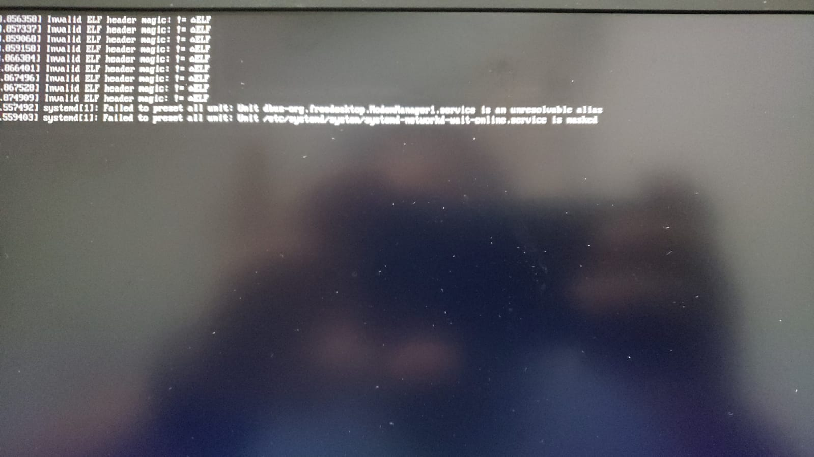
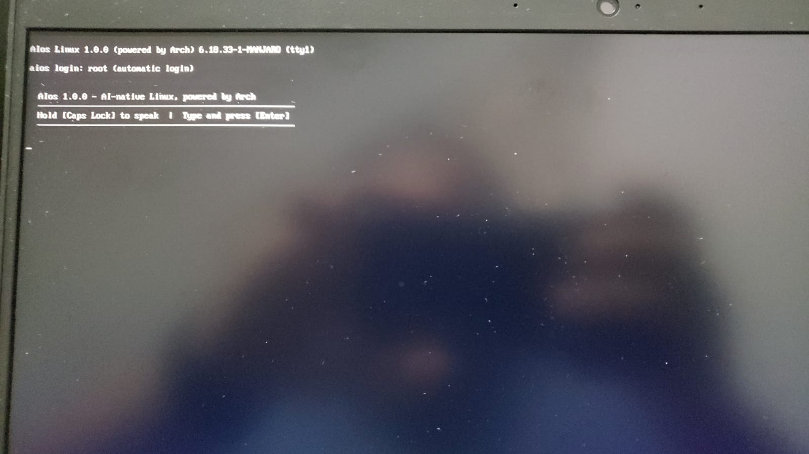
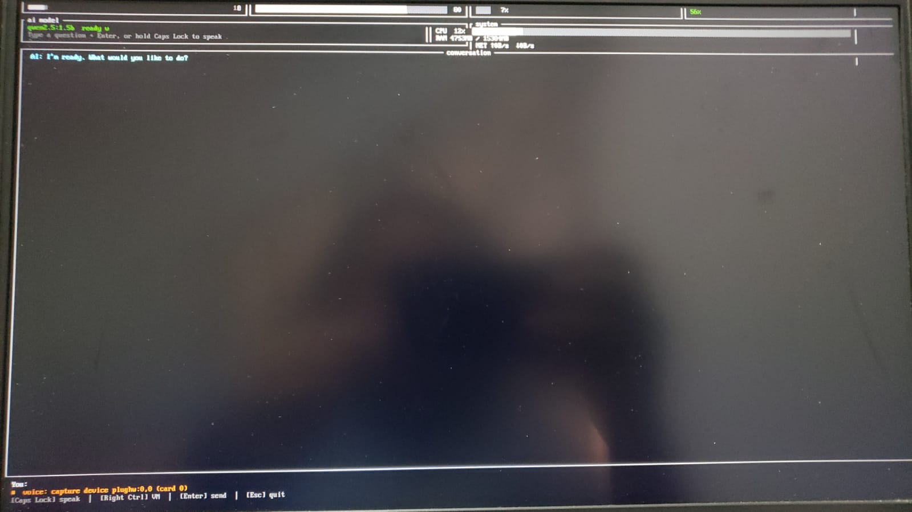

```
 █████╗ ██████╗  ██████╗██╗  ██╗     █████╗ ██╗
██╔══██╗██╔══██╗██╔════╝██║  ██║    ██╔══██╗██║
███████║██████╔╝██║     ███████║    ███████║██║
██╔══██║██╔══██╗██║     ██╔══██║    ██╔══██║██║
██║  ██║██║  ██║╚██████╗██║  ██║    ██║  ██║██║
╚═╝  ╚═╝╚═╝  ╚═╝ ╚═════╝╚═╝  ╚═╝    ╚═╝  ╚═╝╚═╝
```

**The first Linux distro you install by talking to it.**

> Hold `Caps Lock`. Say what you want. Watch it happen.

---

## What is ArchAI?

ArchAI is an Arch-based Linux distribution with AI baked into its core - not as an app, not as a plugin, but as a first-class system layer that manages your OS through voice or text commands.

No command line mastery required. No copy-pasting from Stack Overflow. No reading through pages of documentation after a broken update.

You just talk to it.

---

## Features

### Hold Caps Lock. Talk. Done.
Caps Lock is your push-to-talk key. Press and hold - the LED lights up, you're live. Release - the AI responds and executes. Works in a TTY, under X11, under Wayland, in a VM, anywhere. Implemented at the `evdev` level, below any display server.

### AI layer that actually does things
The AI daemon connects to your preferred provider and has scoped `sudo` access to manage:
- Package installation (`pacman`, AUR)
- System services (`systemctl`)
- Web servers (`nginx`, `apache`, `certbot`)
- Network configuration
- File management in system paths

### Always-on local AI, fully offline
**qwen2.5:1.5b** runs locally on CPU, baked into the ISO - no internet, no GPU, no
API key. It loads at boot and stays resident, so it answers instantly. It's the
AI from the very first second you boot the USB, before you've connected to
anything. (CPU-only on purpose: GPU backends produced corrupted output on some
hardware - deterministic CPU inference works on any machine.)

### Install "on rails"
Boot the ISO, the AI greets you, helps you get online, then installs your chosen
**experience** - you just say which one, and a vetted recipe does the rest:

| Experience | What you get |
|---|---|
| 🖥️ **desktop** | GNOME (Wayland) + Firefox + media + office - a normal computer |
| 🎮 **gaming** | KDE + Steam + Lutris + Wine + GameMode + auto-detected GPU driver |
| 🗄️ **server** | No desktop - SSH + Docker + nginx + firewall, headless |
| 💻 **developer** | KDE + VS Code + Docker + Node/Python/Rust/Go |
| 🔒 **pentest** | XFCE + nmap + Wireshark + aircrack-ng + john + sqlmap |

### Live execution log
A split tmux interface shows what the AI is executing in real time - no black box, no guessing. Works in pure TTY, no desktop required.

### Multi-provider AI support
| Provider | Notes |
|---|---|
| **Claude (Anthropic)** | Recommended - best reasoning |
| **OpenAI** | GPT-4o and variants |
| **Ollama** | Local models, no internet |
| **LM Studio** | Local via LM Studio server |
| **Custom endpoint** | Any OpenAI-compatible API |
| **qwen2.5:1.5b** | Always-on local default, baked in, runs offline on CPU |

---

## Build it yourself

**Yes - anyone can clone this repo and build the exact same ISO.** The complete
recipe is in git. The large binaries (the AI model, the speech model, pip
wheels) are **not** committed - they'd blow past GitHub's size limits - so a
one-time `fetch-deps.sh` downloads them into the build tree first. After that the
build is fully reproducible. (Caveat: Arch is rolling, so a rebuild next month
pulls today's package versions - same recipe, current packages. The AI model is
pinned by tag, so it's identical.)

### Prerequisites
```bash
sudo pacman -S archiso ollama        # archiso builds the ISO; ollama pulls the model
```
You also need internet and `sudo` for the build.

### 1. Download dependencies (once)
```bash
bash scripts/fetch-deps.sh
```
Downloads and bakes into the build tree:
- **qwen2.5:1.5b** (~1 GB) - the local AI model, pulled via Ollama into the ISO's
  Ollama store so the installed system runs the AI fully offline
- **Whisper base** (~140 MB) - offline speech-to-text for push-to-talk
- pip wheels (anthropic, openai) for the optional cloud backends

### 2. Build the ISO
```bash
bash scripts/rebuild.sh
```
Produces `build/aios-1.0.0-x86_64.iso`. Packages, model, and wheels are cached,
so subsequent rebuilds are fast.

### 3. Put it on a USB and boot it
Copy the ISO onto a [Ventoy](https://www.ventoy.net) drive (just drag-and-drop),
or write it directly:
```bash
sudo dd if=build/aios-*.iso of=/dev/sdX bs=4M status=progress oflag=sync
```
Or test in a VM:
```bash
qemu-system-x86_64 -enable-kvm -m 4G -smp 4 \
  -cdrom build/aios-*.iso -boot d -vga std
```

---

## First boot: what you will see

Booting the USB goes through three screens. Here is exactly what to expect so nothing looks alarming.

### 1. Boot messages (this is normal)



You will see a wall of text fly by, including many lines like `Invalid ELF header magic` and a couple of `systemd` warnings. This is completely normal and harmless. If the screen ever gets stuck here, just reboot and let it try again.

### 2. The login screen (you are almost there)



Once you reach this `aios login` screen, you are basically home free. It very rarely gets stuck here. Just be patient while the AI model loads into memory.

### 3. The AI is ready (you are done)



When you see this dashboard with the model showing `ready`, you are done. Hold `Caps Lock` and speak, and the AI will help you get online. From there it can install AIos onto your computer.

---

## Architecture

```
┌─────────────────────────────────────┐
│         User (voice or text)        │
└──────────────┬──────────────────────┘
               │  Caps Lock (evdev, kernel level)
               │  or archspeech-cli "command"
               ▼
┌─────────────────────────────────────┐
│         archspeech-daemon           │
│  ┌─────────────┐  ┌──────────────┐  │
│  │ Cloud AI    │  │ qwen2.5:1.5b │  │
│  │ (Claude /   │→ │ local on CPU │  │
│  │  OpenAI /   │  │ (default)    │  │
│  │  Ollama)    │  └──────────────┘  │
│  └─────────────┘                    │
└──────────────┬──────────────────────┘
               │  tool calls
               ▼
┌─────────────────────────────────────┐
│    System tools (scoped sudo)       │
│  pacman · systemctl · nginx         │
│  certbot · nmcli · chown            │
└─────────────────────────────────────┘
```

---

## Project structure

```
archspeech/
├── archiso/
│   ├── profiledef.sh              # distro identity
│   ├── packages.x86_64            # package list
│   ├── pacman.conf                # build pacman config
│   ├── airootfs/
│   │   ├── etc/
│   │   │   ├── archspeech/        # AI config
│   │   │   ├── keyd/              # Caps Lock remapping
│   │   │   ├── sudoers.d/         # scoped AI permissions
│   │   │   └── systemd/system/    # daemon unit files
│   │   └── usr/local/
│   │       ├── bin/               # archspeech-* executables
│   │       └── lib/archspeech/
│   │           └── installer/     # install profiles
│   ├── efiboot/                   # UEFI boot entries
│   └── syslinux/                  # BIOS boot entries
└── scripts/
    ├── fetch-deps.sh              # one-time dependency download
    └── rebuild.sh                 # fast rebuild (uses cache)
```

---

## Roadmap

- [x] Offline voice in (Whisper STT, push-to-talk on Caps Lock)
- [x] Install "on rails" - experience presets the AI triggers
- [ ] Post-install Phase 2: AI guides WiFi + upgrade to a bigger/cloud model
- [ ] Spoken responses (TTS) for the AI's replies
- [ ] Graphical installer option
- [ ] Automatic update management via voice

---

## Contributing

Pull requests welcome. If you build a new install profile, fix a boot issue, or improve the AI prompting - open a PR.

---

## License

MIT
